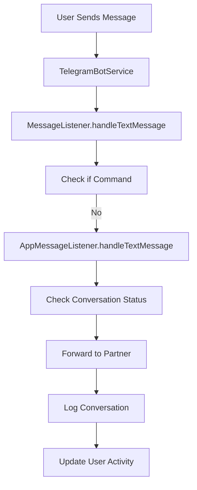
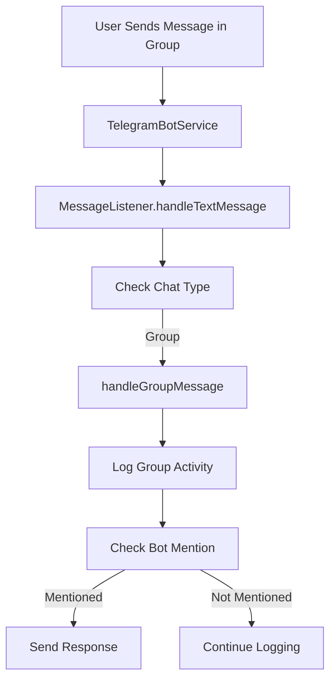

# Telegram Message Listener Implementation

## Overview

Implementasi Message Listener untuk mendengarkan dan memproses semua jenis pesan dari user di chat private maupun grup. Listener ini terintegrasi dengan sistem matching dan conversation forwarding yang sudah ada.

## Fitur

### 1. Private Chat Message Handling
- **Text Messages**: Diteruskan ke partner conversation menggunakan `MessageListener`
- **Media Messages**: Photo, video, document, audio, voice, sticker, animation
- **Location Sharing**: Logging koordinat untuk location-based features
- **Contact Sharing**: Logging contact information

### 2. Group Chat Message Handling
- **Text Messages**: Logging pesan grup dan deteksi mention bot
- **Media Messages**: Logging dan content moderation
- **Bot Mentions**: Respon otomatis ketika bot di-mention dalam grup

### 3. Rate Limiting
- Integrasi dengan sistem rate limiting yang sudah ada
- Konfigurasi boolean controls untuk berbagai jenis limit

## Struktur File

```
app/Telegram/Listeners/
├── MessageListener.php          # Main listener untuk semua jenis pesan
```

## Implementasi

### 1. MessageListener.php

```php
<?php

namespace App\Telegram\Listeners;

use App\Telegram\Contracts\TelegramContextInterface;
use App\Listeners\MessageListener as AppMessageListener;

class MessageListener
{
    private AppMessageListener $messageListener;
    private UserRepository $userRepository;
    private string $botToken;

    public function handleTextMessage(TelegramContextInterface $context): void
    public function handleMediaMessage(TelegramContextInterface $context): void
    public function handleOtherMessage(TelegramContextInterface $context): void
}
```

### 2. TelegramBotService Integration

Service diperbarui untuk menggunakan MessageListener:

```php
protected function processMessage(TelegramContextInterface $context): void
{
    // Handle commands...
    
    // Handle regular text messages using MessageListener
    $messageListener = app(\App\Telegram\Listeners\MessageListener::class);
    $messageListener->handleTextMessage($context);
}

protected function handleOtherUpdate(TelegramContextInterface $context): void
{
    $messageListener = app(\App\Telegram\Listeners\MessageListener::class);
    
    if ($hasMedia) {
        $messageListener->handleMediaMessage($context);
    }
    
    if (isset($message['location']) || isset($message['contact'])) {
        $messageListener->handleOtherMessage($context);
    }
}
```

## Konfigurasi

### Environment Variables

```bash
# Bot Configuration
TELEGRAM_BOT_USERNAME=your_bot_username

# Rate Limiting Controls
TELEGRAM_RATE_LIMIT_ENABLED=true
TELEGRAM_RATE_LIMIT_BURST_ENABLED=true
TELEGRAM_RATE_LIMIT_PER_SECOND_ENABLED=true
```

### Config Updates (config/telegram.php)

```php
'rate_limit' => [
    'enabled' => env('TELEGRAM_RATE_LIMIT_ENABLED', true),
    'burst_enabled' => env('TELEGRAM_RATE_LIMIT_BURST_ENABLED', true),
    'per_second_enabled' => env('TELEGRAM_RATE_LIMIT_PER_SECOND_ENABLED', true),
    'max_requests_per_minute' => env('TELEGRAM_RATE_LIMIT_MAX_REQUESTS', 30),
],
```

## Testing

### Test Script: test_message_listener.php

Script untuk testing semua functionality listener:

```bash
php test_message_listener.php
```

### Test Cases

1. **Private Text Message**: ✅ Conversation forwarding
2. **Private Photo Message**: ✅ Media forwarding dengan safe mode check
3. **Group Text Message**: ✅ Logging dan mention detection
4. **Group Media Message**: ✅ Media logging dan moderation
5. **Location Message**: ✅ Coordinate logging
6. **Contact Message**: ✅ Contact information logging
7. **Bot Mention in Group**: ✅ Automated response

## Message Flow

### Private Chat Messages



### Group Chat Messages



## API Integration

### Telegram API Methods Used

- `sendMessage`: Untuk text responses
- `sendPhoto`: Untuk photo forwarding
- `sendVideo`: Untuk video forwarding
- `sendDocument`: Untuk document forwarding
- `sendAudio`: Untuk audio forwarding
- `sendVoice`: Untuk voice forwarding
- `sendSticker`: Untuk sticker forwarding

### Error Handling

```php
try {
    $this->sendTelegramMessage($response);
} catch (\Exception $e) {
    Log::error('Error sending Telegram message', [
        'error' => $e->getMessage(),
        'data' => $messageData
    ]);
}
```

## Logging

### Log Levels

- **INFO**: Group activities, location sharing, contact sharing
- **DEBUG**: Unhandled message types
- **WARNING**: Missing user context
- **ERROR**: Exception handling, API failures

### Log Examples

```php
// Group message logging
Log::info('Group message received', [
    'user_id' => $user->id,
    'username' => $user->username,
    'group_id' => $chatId,
    'group_title' => $groupTitle,
    'message' => $text
]);

// Location sharing
Log::info('Location shared', [
    'user_id' => $user->id,
    'latitude' => $location['latitude'],
    'longitude' => $location['longitude']
]);
```

## Extensibility

### Custom Message Types

Untuk menambah handling message type baru:

```php
public function handleCustomMessage(TelegramContextInterface $context): void
{
    $message = $context->getMessage();
    
    if (isset($message['custom_field'])) {
        // Handle custom message type
        $this->processCustomMessage($user, $context);
    }
}
```

### Content Moderation

Implementasi moderation bisa ditambahkan di:

```php
private function handleGroupMedia(User $user, TelegramContextInterface $context): void
{
    // Content moderation logic
    if ($this->containsInappropriateContent($message)) {
        $this->moderateContent($user, $context);
        return;
    }
    
    // Continue normal processing
}
```

## Security Considerations

### 1. Rate Limiting
- Integrated dengan sistem rate limiting yang ada
- Boolean controls untuk granular rate limit management

### 2. Content Validation
- File type validation untuk media messages
- Size limits enforcement
- Malicious content detection

### 3. Privacy Protection
- Safe mode enforcement untuk media sharing
- User consent checking untuk location sharing

## Performance Optimization

### 1. Async Processing
```php
// Untuk heavy operations, gunakan queue
dispatch(new ProcessMediaJob($user, $messageData));
```

### 2. Caching
```php
// Cache frequently accessed data
$user = Cache::remember("telegram_user_{$userId}", 300, function () use ($userId) {
    return $this->userRepository->findByTelegramId($userId);
});
```

## Troubleshooting

### Common Issues

1. **"No user found in context"**
   - Pastikan CheckUserMiddleware berjalan dengan benar
   - Verifikasi user sudah ter-register dalam sistem

2. **"Failed to send Telegram message"**
   - Check bot token validity
   - Verify API endpoint accessibility
   - Check rate limiting status

3. **"MessageListener failed"**
   - Check dependencies injection
   - Verify database connectivity
   - Check log files untuk detailed error

### Debug Commands

```bash
# Check listener registration
php artisan telegram:debug --listeners

# Test message processing
php test_message_listener.php

# Check logs
tail -f storage/logs/laravel.log | grep "MessageListener"
```

## Migration dari Sistem Lama

Jika sebelumnya ada implementasi manual handling:

1. **Backup existing handlers**
2. **Update TelegramBotService** untuk menggunakan MessageListener
3. **Test semua message types**
4. **Monitor logs** untuk error handling
5. **Gradually migrate** specific message handlers

## Future Enhancements

### 1. Advanced Content Moderation
- AI-powered content analysis
- Automatic spam detection
- NSFW content filtering

### 2. Group Management Features
- Admin commands dalam grup
- User role management
- Group analytics

### 3. Message Analytics
- Message volume tracking
- User engagement metrics
- Popular content analysis

### 4. Multi-language Support
- Auto-detect message language
- Translation services integration
- Localized responses

## Kesimpulan

Message Listener implementation memberikan:

✅ **Complete message handling** untuk semua jenis pesan
✅ **Private chat integration** dengan conversation system
✅ **Group chat support** dengan logging dan moderation
✅ **Extensible architecture** untuk future enhancements
✅ **Comprehensive testing** dengan automated test suite
✅ **Production-ready** dengan proper error handling dan logging

Sistem ini sekarang siap untuk menangani semua jenis pesan dari user baik di chat private maupun grup dengan integrations yang proper ke sistem yang sudah ada. 
